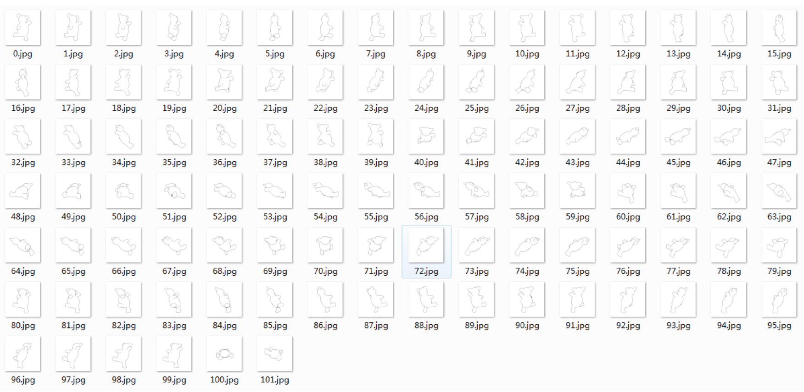

Line Drawings View Tool [](https://travis-ci.org/zddhub/trianglemesh) 
=======================

This project serves [OpenSSE](https://github.com/zddhub/opensse), that gets line-drawing images for each model (support *.off and *.obj) using viewpoint matrix(under `../data/view/`).


Demo
====

In [my demo](http://opensse.com), I used 102 viewpoints on globe to project line drawings.

### View points(red points)


### Model


### Line drawings images




Compile
=======

```shell
mkdir release; cd release
qmake ../trianglemesh.pro -o Makefile
make
```

You will get your executable tool under `bin` folder.

Usage
=====
```shell
gen_view_image modelfile xfdir viewnum imagedir
```
example:
```shell
mkdir teddy_images
./gen_view_image ../../data/teddy.off ../../data/view/ 102 teddy_images
```

Support for OpenSSE
===================

There is a tool `./linedrawing_project.sh` to prepare view images for [OpenSSE](https://github.com/zddhub/opensse/wiki/How-to-train-data#get-line-drawing-views), Use it to get 102 view images for each modal. After you compile code, and return root path to run:

```sh
./linedrawing_project.sh -d ~/Database/SHREC12 -p *.off
```

Troubleshooting
===============

* Compile error on macOS like below:

```sh
.../clang_64/lib/QtCore.framework/Headers/qsystemdetection.h:197:12: fatal error: 'TargetConditionals.h' file not found
```

How to fix:

```
macx : QMAKE_MAC_SDK=macosx10.13 # Change this to your macOS version if you are using macOS
```

Thanks
======
- [Szymon Rusinkiewicz](http://www.cs.princeton.edu/~smr/)
- [Tilke Judd](http://people.csail.mit.edu/tjudd/)

License
=======

Code is under the [Apache License, Version 2.0](http://www.apache.org/licenses/LICENSE-2.0).

Donate
======

I accept tips through [Alipay](http://img.blog.csdn.net/20140506233949640). Scan below qr code to donate:

.

Contact me
==========

If you have any question or idea, please [email to me](mailto:zddhub@gmail.com).
